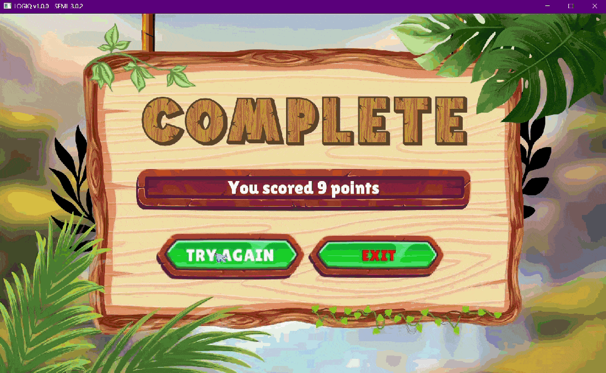

# 🧠 **LOGIQ**
It is a desktop game where users select a time interval, answer riddle questions under a timer, and see how many points they can score before time runs out.

✨ **Features**
 - Select your preferred time interval
 - Answer riddle questions by clicking 4 buttons (choices)
 - Points automatically calculated +1 each correct answer
 - Total score displayed when the timer ends

🕹️ **Gameplay Walkthrough**
 - A quick look at how to play LOGIQ and enjoy the game step by step.

**🎮 Homepage**

**🎮 Time Selection**

**🎮 Answer Feedback**

**🎮 Final Results**

🚀 **How to Run**
 - Install SFML v1.7 or the latest version.
 - Copy all required SFML DLLs (e.g., sfml-graphics-2.dll,       sfml-window-2.dll, sfml-system-2.dll) into the same folder as your executable.
 - Open the project in VS Code or Microsoft Visual Studio 2022 and rename it main.
 - Compile and run LogiqQuest.cpp (or the main file).

📝 **Notes**
 - Minor refinements and additional features are planned for future updates.
